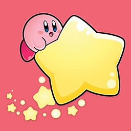

# KirbyJump

**Virtual Environments Agent Programming** | Universidad Panamericana 2019

**Teacher: Linda Jimena Hernández**  
**Student: Luis Enrique Correa Morán**  
  
0186950
March 2019

## Table of Contents
  

* [Levels](#levels)
* [Game Mechanics](#game-mechanics)
* [Gameplay](#gameplay)
* [Screenshots](#screenshots)

## Levels

The game does not follow a separate scene structure. As it is in its core an endless runner, levels are implemented in the speeds and patterns at wich the clouds are moving an distributed.

### Speed

Clouds move at different speeds, adjusting level difficulty trough the combination of the speeds of different clounds at each stage, as clouds have their own internal difficulty, different combinations of such difficulty, create different **levels** within the game.

For example, from the normal five clouds in a particular position, two of such could be level 2 clouds, whilst the other three could be level 4, wich would be equivalent to level 3 within the game.

As clouds can only be so fast in order to keep the game fun, the top speed is represented as a 1.8f.

The detailed description of levels and their values is presented below.

[Add Table of Diffs]

## Game Mechanics

The objective of the game is to make kirby reach the highest point posible, while using clouds to climp his way up.

In order to jump, you must drag your finger from Kirby and into the opposite direction you wish Kirby to jump to. The longer (distance-wise) the drag is, the more force Kirby will use.

## Gameplay

### Mechanics

The game requires Kirby to move up as high as possible, by jumping from cloud to cloud by performing a drag on the screen in the desired direction.  

### Clouds

The game get progressively harder, as clouds start making the journey harder each time. They will start moving faster and appear in lesser amounts so that Kirby has to plan each move carefully.

Kirby must be careful, if he hits a cloud from below he will lose a life.

## Programming Elements

Several programming elements were implemented so that the game couldbe both fun and functional. such principles are explained below.

### Colliders

Collisions are managed so it is possible to detect and make Kirby interact to its environment. For example GameOver conditions are implemented over this principle as well as the powerup system.

### Animations

Basic animations were used to represent Kirby's state. He is always blinking, and reacts to its jumpin, landing and idle states

### Projectiles

Kirby itself handles projectile behaviour. By using a rigidbody and implementig concepts of velocity and force, it was achieved the desired projectile physics within the game.

### Audio

Sounds come primarily from two sources, in Kirby's case sounds are played when Kirby jumps and when he loses. The second source is embodied by the GameController (empty object) contains the ambient music for the game, which plays back in loop.

### Health System

Kirby only has three lifes to get as far as he can. He may lose them by hitting clouds, and there's no chance of getting them back.

He may lose all of them when falling from c

## Screenshots

### Main Screen

### Main Game

### Game Over

