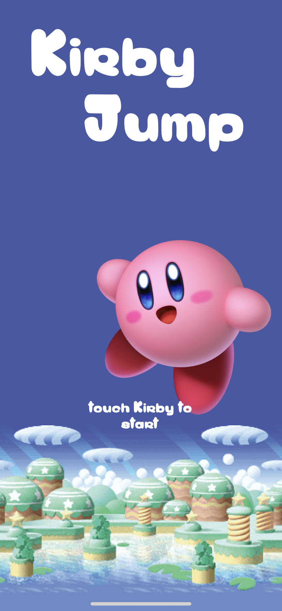
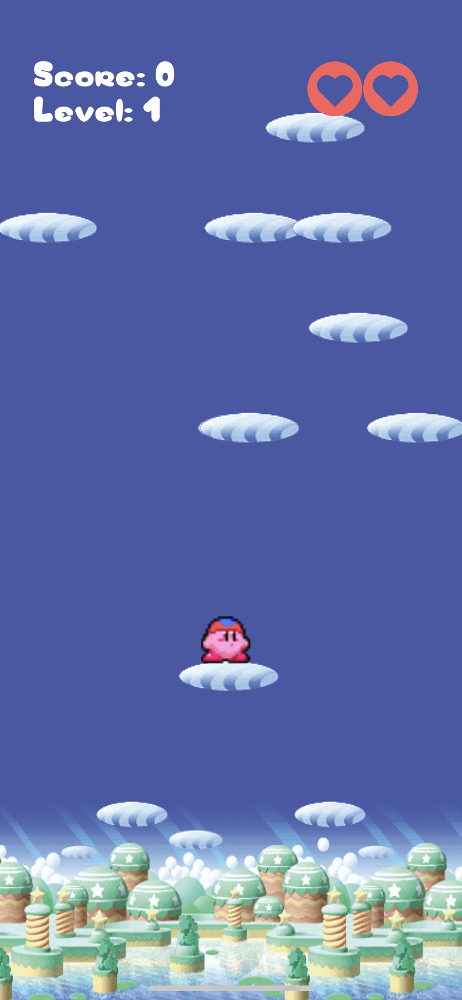
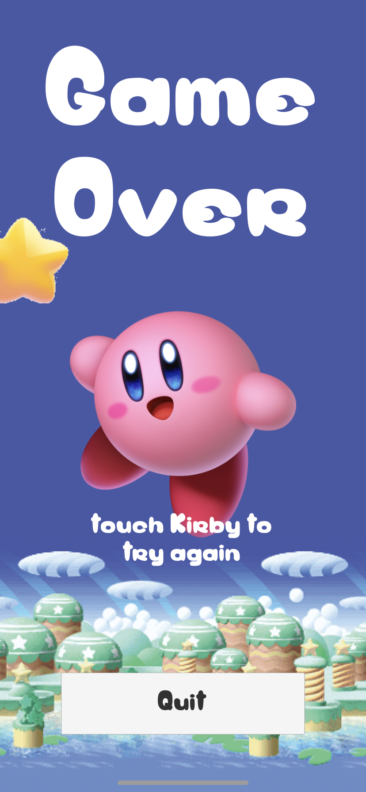

# KirbyJump

**Virtual Environments Agent Programming** | *Universidad Panamericana 2019*

**Teacher:** Linda Jimena Hernández  
**Student:** Luis Enrique Correa Morán  
  
0186950
March 2019

  

## Table of Contents  

* [Levels](#levels)
* [Game Mechanics](#game-mechanics)
* [Programming Elements](#programming-elements)
* [Screenshots](#screenshots)

## Levels

The game does not follow a separate scene structure. As it is in its core an endless runner, levels are implemented in the speeds and patterns at wich the clouds are moving an distributed. Augmenting difficulty with each new height reached by Kirby.

### Speed

Clouds move at different speeds, adjusting level difficulty trough the combination of the speeds of different clounds at each stage, as clouds have their own internal difficulty, different combinations of such difficulty, create different **levels** within the game.

For example, from the normal five clouds in a particular position, two of such could be level 2 clouds, whilst the other three could be level 4, wich would be equivalent to level 4 within the game. Each level consists of clouds with speeds up to the one provided in that level, in any combination.

As clouds can only be so fast in order to keep the game fun, the top speed is represented as a 2.5f.

The detailed description of levels and their values is presented below.

| Level | 1    | 2    | 3    | 4    | 5    | 6    | 7    | 8    | 9    | 10   |
|:-----:|------|------|------|------|------|------|------|------|------|------|
| Speed | 0.3f | 0.5f | 0.7f | 1.0f | 1.5f | 1.6f | 1.8f | 2.0f | 2.5f | 2.8f |

## Game Mechanics

The objective of the game is to make kirby reach the highest point posible, while using clouds to climp his way up.

In order to jump, you must drag your finger from Kirby and into the opposite direction you wish Kirby to jump to. The longer (distance-wise) the drag is, the more force Kirby will use to perform a jump.

The player must avoid touching clouds from below and falling of of clouds, as they dissapear once a player has succesfully reached a point above them.

The game gets progressively harder, as clouds start making the journey harder each time. They will start moving faster and appear in lesser amounts so that Kirby has to plan each move carefully.

## Programming Elements

Several programming elements were implemented so that the game couldbe both fun and functional. such principles are explained below.

### Environment

The game is proceduraly generated, thi means that clouds generate dinamically each time the game is run, and respond to the player's progress in the game.

### Colliders & Rigidbody2D

Collisions and Rigidbody2D components are managed in such a way that they make possible to detect meaningful events and make Kirby interact to its environment. For example GameOver conditions, Kirby's movements and clouds' behaviour are implemented over this principles.

### Animations

Basic animations were used to represent Kirby's state. He is always blinking, and reacts to its jumping, landing and idle states, moving between such states by script code.

### Projectiles

Kirby itself handles projectile behaviour. By using a rigidbody and implementig concepts of velocity and force, it was achieved the desired projectile physics within the game.

### Audio

Sounds come primarily from two sources, in Kirby's case sounds are played when Kirby jumps and when he loses. The second source is embodied by the GameController (empty object) contains the ambient music for the game, which plays back in loop.

### Health System

Kirby only has three lifes to get as far as he can. He may lose them by hitting clouds, and there's no chance of getting them back.

He may lose all of them when falling from a cloud and having nowhere to land to.

## Screenshots

Some images of the final game.

### Main Screen

### Main Game

### Game Over

